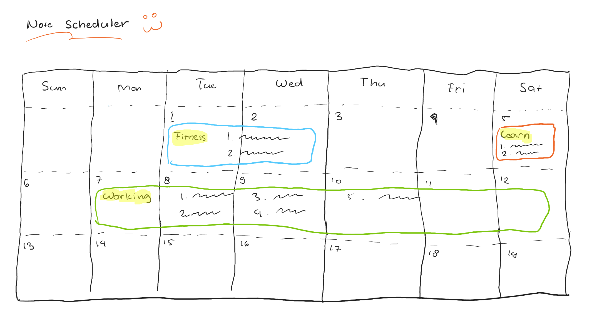

# Note Scheduler 😃


**Note Scheduler** adalah sebuah aplikasi penanggalan aktivitas menjadi sebuah schedule dimana kamu bisa membuat, mengubah, serta menghapus schedule dan aktivitas tersebut. Aktivitas yang ditampilkan pada tanggal berisi judul, list aktivitas, dan tanggal berlangsungnya aktivitas.

Disini kamu diminta untuk membuat sebuah **API** yang akan digunakan aplikasi **Note Scheduler** dengan ketentuan sebagai berikut :

- [API Requirement](#api-requirement)

    1. [Mengambil semua data _Schedule_](#1-mengambil-semua-data-schedule)
    1. [Pencarian data _Schedule_ berdasarkan tanggal keberlangsungan](#2-pencarian-data-schedule-berdasarkan-tanggal-keberlangsungan)
    1. [Pencarian data _Schedule_ berdasarkan judul](#3-pencarian-data-schedule-berdasarkan-judul)
    1. [Pencarian data _Schedule_ berdasarkan ID _Schedule_](#4-pencarian-data-schedule-berdasarkan-id-schedule)
    1. [Menambah _Schedule_ baru](#5-menambah-schedule-baru)
    1. [Mengubah _Schedule_](#6-mengubah-schedule)
    1. [Menghapus _Schedule_](#7-menghapus-schedule)
    1. [Mengambil data _Aktivitas_ berdasarkan ID _Schedule_](#8-mengambil-data-aktivitas-berdasarkan-id-schedule)
    1. [Mengambil data _Aktivitas_ berdasarkan ID _Aktivitas_](#9-mengambil-data-aktivitas-berdasarkan-id-aktivitas)
    1. [Menambah _Aktivitas_ baru pada _Schedule_ tertentu](#10-menambah-aktivitas-baru-pada-schedule-tertentu)
    1. [Mengubah _Aktivitas_ pada _Schedule_ tertentu](#11-mengubah-aktivitas-pada-schedule-tertentu)
    1. [Menghapus _Aktivitas_ pada _Schedule_ tertentu](#12-menghapus-aktivitas-pada-schedule-tertentu)

- [Contoh Visual 😄](#contoh-visual-😄)
- [Ketentuan 👍](#ketentuan-👍)

<br>

***

<br>

## **API Requirement**

<br>

#### **1. Mengambil semua data _Schedule_**
[Back to 🔝](#note-scheduler-😃)

Contoh respon:

```json
{
    "code" : 200,
    "data" : [
        {
            "id" : 1,
            "judul" : "Fitness",
            "start_at" : "2022-06-01T00:00:00Z07:00",
            "end_at" : "2022-06-02T23:59:59Z07:00",
            "activities": [
                {
                    "id" : 1,
                    "schedule_id" : 1,
                    "activity" : "Elit reprehenderit ex ut"
                },
                {
                    "id" : 2,
                    "schedule_id" : 1,
                    "activity" : "Exercitation ex sit cillum"
                }
            ]
        },
        {
            "id" : 2,
            "judul" : "Learn",
            "start_at" : "2022-06-05T00:00:00Z07:00",
            "end_at" : "2022-06-05T23:59:59Z07:00",
            "activities": [
                {
                    "id" : 3,
                    "schedule_id" : 2,
                    "activity" : "Culpa ad esse sint veniam"
                },
                {
                    "id" : 4,
                    "schedule_id" : 2,
                    "activity" : "Aliqua qui dolor do anim ex."
                }                
            ]
        },
        {
            "id" : 3,
            "judul" : "Working",
            "start_at" : "2022-06-07T00:00:00Z07:00",
            "end_at" : "2022-06-12T23:59:59Z07:00",
            "activities": [
                {
                    "id" : 5,
                    "schedule_id" : 3,
                    "activity" : "Eiusmod laborum proident"
                },
                {
                    "id" : 6,
                    "schedule_id" : 3,
                    "activity" : "Officia occaecat"
                },  
                {
                    "id" : 7,
                    "schedule_id" : 3,
                    "activity" : "Sit aute commodo"
                },  
                {
                    "id" : 8,
                    "schedule_id" : 3,
                    "activity" : "Sit aute commodoEt"
                },  
                {
                    "id" : 9,
                    "schedule_id" : 3,
                    "activity" : "Excepteur proident sunt"
                }
            ]
        }
    ]
}
```

<br>

***

<br>

#### **2. Pencarian data _Schedule_ berdasarkan tanggal keberlangsungan**
[Back to 🔝](#note-scheduler-😃)

Filter data menggunakan tanggal, misal:

Tanggal 1 juni 2022 sampai 2 juni 2022

Contoh respon:

```json
{
    "code" : 200,
    "data" : [
        {
            "id" : 1,
            "judul" : "Fitness",
            "start_at" : "2022-06-01T00:00:00Z07:00",
            "end_at" : "2022-06-02T23:59:59Z07:00",
            "activities": [
                {
                    "id" : 1,
                    "schedule_id" : 1,
                    "activity" : "Elit reprehenderit ex ut"
                },
                {
                    "id" : 2,
                    "schedule_id" : 1,
                    "activity" : "Exercitation ex sit cillum"
                }
            ]
        }
    ]
}
```

<br>

***

<br>

#### 3. **Pencarian data _Schedule_ berdasarkan judul**
[Back to 🔝](#note-scheduler-😃)

Filter data menggunakan judul schedule, misal:

judul LIKE "%Fitness%"

Contoh respon:

```json
{
    "code" : 200,
    "data" : [
        {
            "id" : 1,
            "judul" : "Fitness",
            "start_at" : "2022-06-01T00:00:00Z07:00",
            "end_at" : "2022-06-02T23:59:59Z07:00",
            "activities": [
                {
                    "id" : 1,
                    "schedule_id" : 1,
                    "activity" : "Elit reprehenderit ex ut"
                },
                {
                    "id" : 2,
                    "schedule_id" : 1,
                    "activity" : "Exercitation ex sit cillum"
                }
            ]
        }
    ]
}
```

<br>

***

<br>

#### 4. **Pencarian data _Schedule_ berdasarkan ID _Schedule_**
[Back to 🔝](#note-scheduler-😃)

Filter data menggunakan judul schedule, misal:

id = 1

Contoh respon:

```json
{
    "code" : 200,
    "data" : {
        "id" : 1,
        "judul" : "Fitness",
        "start_at" : "2022-06-01T00:00:00Z07:00",
        "end_at" : "2022-06-02T23:59:59Z07:00",
        "activities": [
            {
                "id" : 1,
                "schedule_id" : 1,
                "activity" : "Elit reprehenderit ex ut"
            },
            {
                "id" : 2,
                "schedule_id" : 1,
                "activity" : "Exercitation ex sit cillum"
            }
        ]
    }
    
}
```

<br>

***

<br>

#### **5. Menambah _Schedule_ Baru**
[Back to 🔝](#note-scheduler-😃)

Contoh respon:

```json
{
    "code" : 201,
    "data" : [
        {
            "id" : 4,
            "judul" : "Schedule Baru",
            "start_at" : "2022-06-13T00:00:00Z07:00",
            "end_at" : "2022-06-13T23:59:59Z07:00",
            "activities": [
                {
                    "id" : 10,
                    "schedule_id" : 4,
                    "activity" : "Laboris commodo culpa culpa laboris"
                }
            ]
        }
    ]
}
```

<br>

***

<br>

#### **6. Mengubah _Schedule_**
[Back to 🔝](#note-scheduler-😃)

Contoh respon:
```json
{
    "code" : 200,
    "data" : [
        {
            "id" : 4,
            "judul" : "Schedule Baru yang sudah di update",
            "start_at" : "2022-06-13T00:00:00Z07:00",
            "end_at" : "2022-06-13T23:59:59Z07:00",
            "activities": [
                {
                    "id" : 10,
                    "schedule_id" : 4,
                    "activity" : "Laboris commodo culpa culpa laboris"
                }
            ]
        }
    ]
}
```

<br>

***

<br>

#### **7. Menghapus _Schedule_**
[Back to 🔝](#note-scheduler-😃)

Contoh respon:

```json
{
    "code" : 200
}
```

<br>

***

<br>

#### **8. Mengambil data _Aktivitas_ berdasarkan ID _Schedule_**
[Back to 🔝](#note-scheduler-😃)

Contoh respon:

```json
{
    "code" : 200,
    "data": [
        {
            "id" : 1,
            "schedule_id" : 1,
            "activity" : "Elit reprehenderit ex ut"
        },
        {
            "id" : 2,
            "schedule_id" : 1,
            "activity" : "Exercitation ex sit cillum"
        }
    ]
}
```

<br>

***

<br>

#### **9. Mengambil data _Aktivitas_ berdasarkan ID _Aktivitas_**
[Back to 🔝](#note-scheduler-😃)

Contoh respon:

```json
{
    "code" : 200,
    "data": {
        "id" : 1,
        "schedule_id" : 1,
        "activity" : "Elit reprehenderit ex ut"
    }
        
}
```

<br>

***

<br>

#### **10. Menambah _Aktivitas_ baru pada _Schedule_ tertentu**
[Back to 🔝](#note-scheduler-😃)

Contoh respon:

```json
{
    "code" : 201,
    "data" : [
        {
            "id" : 1,
            "judul" : "Fitness",
            "start_at" : "2022-06-01T00:00:00Z07:00",
            "end_at" : "2022-06-02T23:59:59Z07:00",
            "activities": [
                {
                    "id" : 1,
                    "schedule_id" : 1,
                    "activity" : "Elit reprehenderit ex ut"
                },
                {
                    "id" : 2,
                    "schedule_id" : 1,
                    "activity" : "Exercitation ex sit cillum"
                },
                {
                    "id" : 11,
                    "schedule_id" : 1,
                    "activity" : "Exercitation id"
                }
            ]
        }
    ]
}
```

<br>

***

<br>

#### **11. Mengubah _Aktivitas_ pada _Schedule_ tertentu**
[Back to 🔝](#note-scheduler-😃)

Contoh respon:

```json
{
    "code" : 200,
    "data" : [
        {
            "id" : 1,
            "judul" : "Fitness",
            "start_at" : "2022-06-01T00:00:00Z07:00",
            "end_at" : "2022-06-02T23:59:59Z07:00",
            "activities": [
                {
                    "id" : 1,
                    "schedule_id" : 1,
                    "activity" : "Amet incididunt pariatur esse"
                },
                {
                    "id" : 2,
                    "schedule_id" : 1,
                    "activity" : "Exercitation ex sit cillum"
                },
                {
                    "id" : 11,
                    "schedule_id" : 1,
                    "activity" : "Exercitation id"
                }
            ]
        }
    ]
}
```

<br>

***

<br>

#### **12. Menghapus _Aktivitas_ pada _Schedule_ tertentu**
[Back to 🔝](#note-scheduler-😃)

Contoh respon:

```json
{
    "code" : 200,
    "data" : [
        {
            "id" : 1,
            "judul" : "Fitness",
            "start_at" : "2022-06-01T00:00:00Z07:00",
            "end_at" : "2022-06-02T23:59:59Z07:00",
            "activities": [
                {
                    "id" : 2,
                    "schedule_id" : 1,
                    "activity" : "Exercitation ex sit cillum"
                },
                {
                    "id" : 11,
                    "schedule_id" : 1,
                    "activity" : "Exercitation id"
                }
            ]
        }
    ]
}
```

<br>

***

<br>


## **Contoh Visual 😄**
[Back to 🔝](#note-scheduler-😃)



<br>

***

<br>

## **Ketentuan 👍**
[Back to 🔝](#note-scheduler-😃)
- Harus menggunakan bahasa pemrograman **Go (Golang)**
- Harus menggunakan database **SQL (mysql, postgresql)**
- Diperbolehkan menggunakan framework atau dependency tambahan
